#  Fit Journal

Fit Journal is a modern, feature-rich Android application designed to help fitness enthusiasts track their workouts, monitor progress, and manage their exercise library. Built with the latest Android development practices, it offers a seamless and intuitive experience for journaling your fitness journey.

## 📱 App Screenshots

### Onboarding & Tutorial Flow
The app features a comprehensive onboarding process that introduces users to the core functionalities:

| 1. Welcome | 2. Journal Overview | 3. Workout Library |
| :---: | :---: | :---: |
| 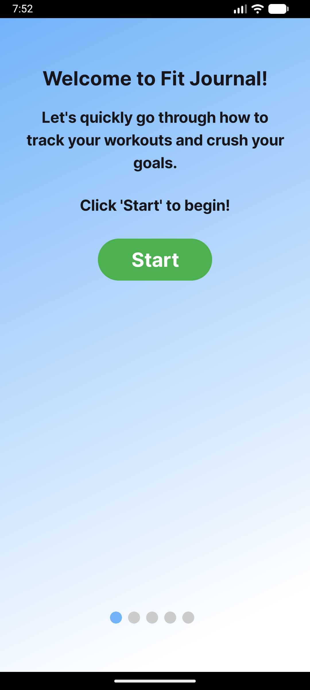 | 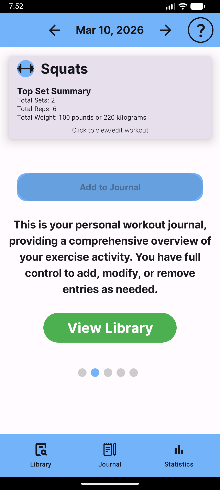 | 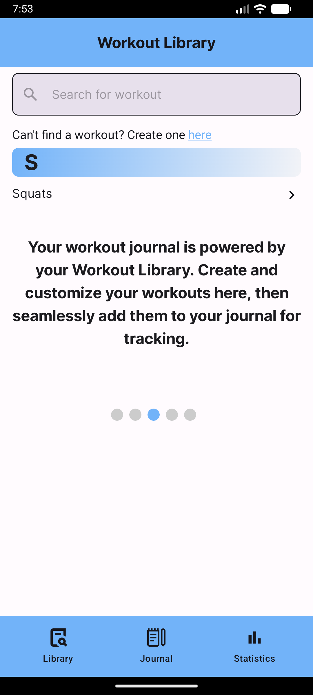 |

| 4. Progress Stats | 5. Ready to Start |
| :---: | :---: |
| 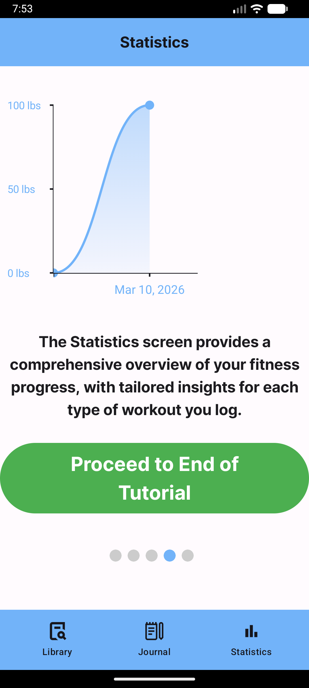 | 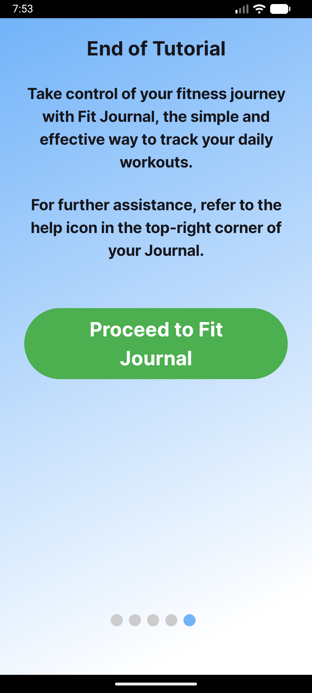 |

### Home & Journaling
Track your daily workouts with ease. View your progress for the day or look back at past entries.

| Empty Journal | Filled Journal | Edit Workout |
| :---: | :---: | :---: |
| 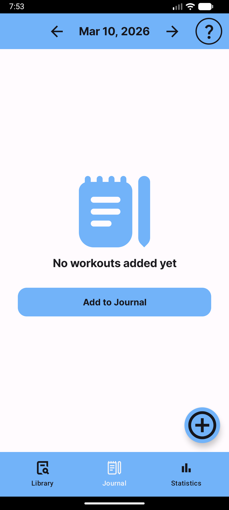 | 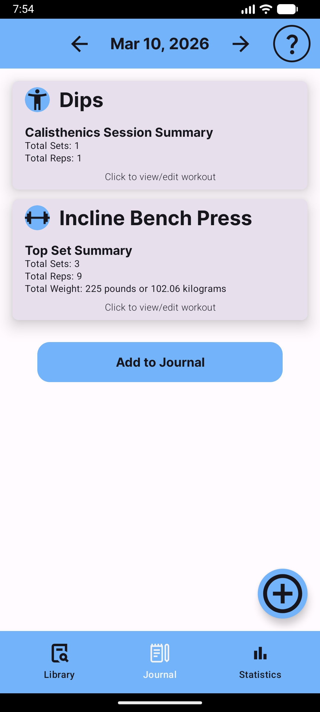 | 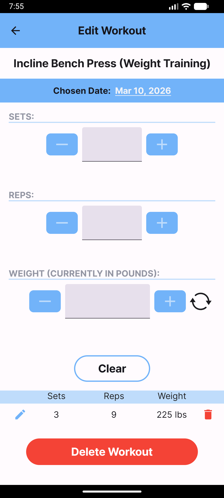 |

### Workout Library
Manage your personal list of exercises. Create new ones or edit existing ones to fit your routine.

| Workout Library | Edit Library Item |
| :---: | :---: |
| 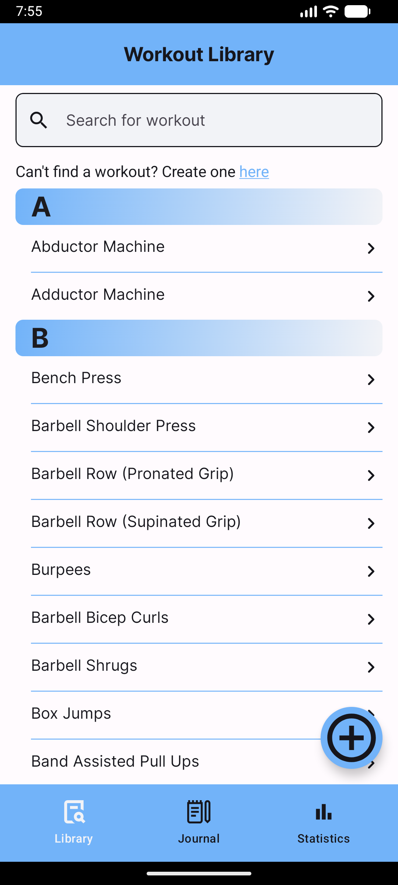 | 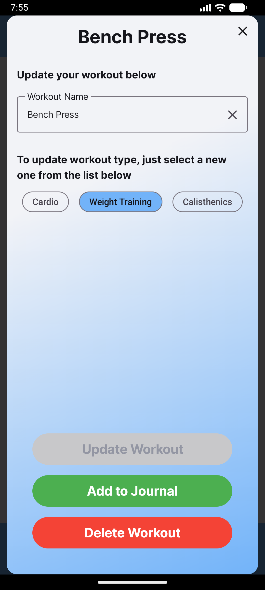 |

### Statistics & Progress
Visualize your fitness journey with interactive charts and detailed workout statistics.

| Overall Stats | Specific Progress |
| :---: | :---: |
| 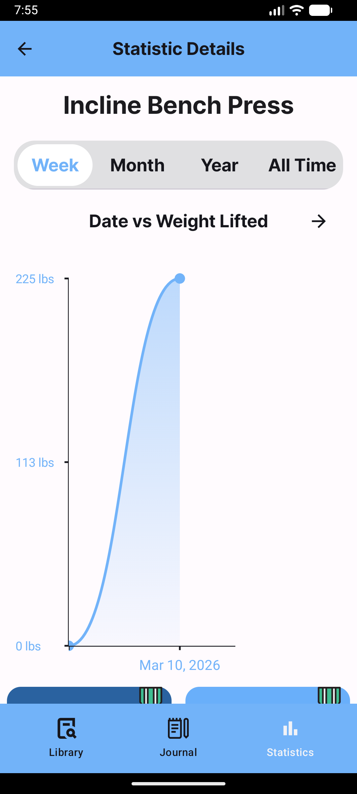 | 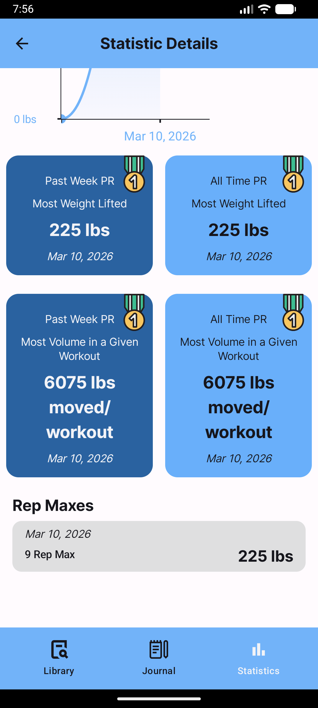 |

## ✨ Features

- **Personalized Onboarding**: A smooth introduction to the app's capabilities using interactive Lottie animations.
- **Dynamic Workout Journal**: Track your daily fitness activities with an easy-to-use calendar interface.
- **Exercise Library**: Build and manage your own database of exercises.
- **In-depth Statistics**: Visualize your progress over time with interactive charts powered by YCharts.
- **Versatile Workout Types**: Support for various training styles, including:
    - **Strength Training**: Track sets, reps, and weights.
    - **Calisthenics**: Log bodyweight exercises.
    - **Cardio**: Monitor duration and intensity.
- **Modern UI**: Fully built with **Jetpack Compose** and **Material 3** for a sleek, responsive look and feel.
- **Offline First**: Uses **Realm Database** for fast, reliable local storage.

## 🛠️ Tech Stack

- **Language**: [Kotlin](https://kotlinlang.org/)
- **UI Framework**: [Jetpack Compose](https://developer.android.com/jetpack/compose)
- **Dependency Injection**: [Dagger Hilt](https://developer.android.com/training/dependency-injection/hilt-android)
- **Local Database**: [Realm Kotlin SDK](https://www.mongodb.com/docs/realm/sdk/kotlin/)
- **Architecture**: MVVM (Model-View-ViewModel)
- **Animations**: [Lottie for Android](https://github.com/airbnb/lottie-android)
- **Graphing**: [YCharts](https://github.com/yml-org/ycharts)
- **Networking/Core**: Kotlin Coroutines & Flow

## 🚀 Getting Started

### Prerequisites

- Android Studio Koala or newer.
- Android SDK 29+.
- JDK 17.

### Installation

1. Clone the repository:
   ```bash
   git clone https://github.com/yourusername/FitJournal-Android.git
   ```
2. Open the project in Android Studio.
3. Sync the project with Gradle files.
4. (Optional) Configure Google Ads ID in `gradle.properties` if you wish to enable AdMob.

## 🏗️ Project Structure

- `core/`: Shared components, utilities, and base data layers.
- `home/`: Workout journaling and main dashboard features.
- `library/`: Exercise management and library views.
- `addWorkout/`: Workflows for logging new workout sessions.
- `onboarding/`: User first-run experience.
- `statistics/`: Progress tracking and data visualization.

---

Made with ❤️ for the fitness community.
